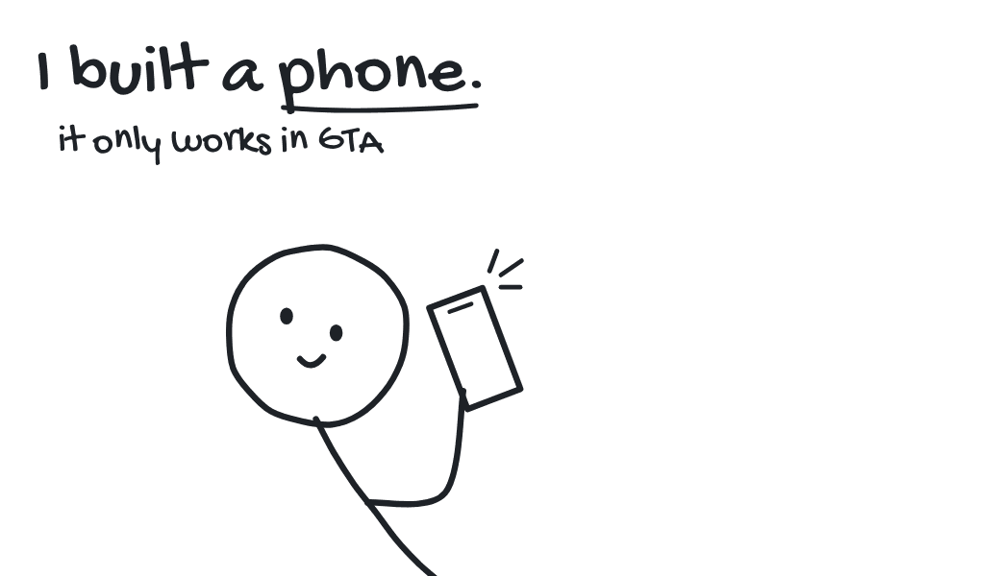

<picture>
  <source media="(prefers-color-scheme: dark)" srcset="assets/phone-dark.gif">
  
</picture>

 
 

**[Taintless Phone](https://taintlessphone.com)** &nbsp; One connected phone for a whole FiveM city, with Cloud accounts, physical SIM cards, and an API for custom apps. Most of my time goes here.

**[Taintless](https://taintless.dev)** &nbsp; Storefronts and growth analytics for Tebex sellers.

**[CfxNatives](https://cfxnatives.dev)** &nbsp; Reference documentation for FiveM natives, with examples for ESX, QBCore, Qbox, and Ox.

**[UZ Scripts](https://uz-scripts.com)** &nbsp; FiveM scripts, some of them [open source](https://github.com/uz-scripts).
